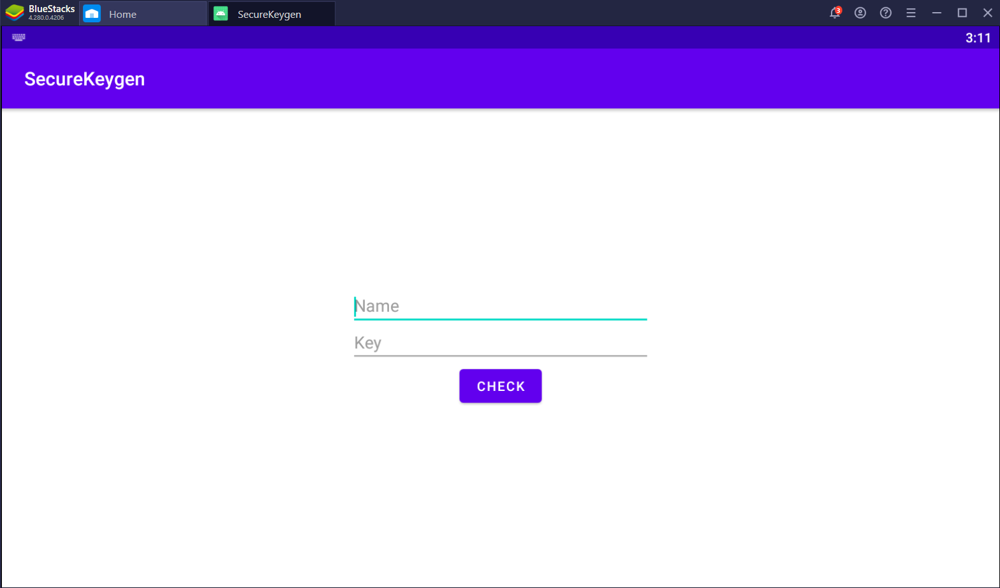

## SecureKeygen
 
  
    

### Description
You dont have to buy a license if you can generate one. Please find a correct key for user "hcmus@fortnight". The flag will be "f0rtn1ght{key}" (key is in lowercase)

### Hints
1. Check function is written in C, not Java.
2. [Reference](https://www.ragingrock.com/AndroidAppRE/reversing_native_libs.html)
3. [Instrumentation tool](https://frida.re/)

### Summary
Bài này thuật toán tạo key khá dễ, nhưng quan trọng là phải biết hàm tạo key nằm ở chỗ nào.

### Detailed solution
Bài này có hai cách giải, một cách là static, tức là chỉ đọc và phân tích code, còn cách thứ hai là dynamic, ở cách này thay vì hiểu code thì ta sẽ quan sát các giá trị trong hàm check bằng tool [frida](https://frida.re/).

Đầu tiên mở app lên chạy

App khá cơ bản, chỉ có 2 ô để nhập input và một nút check. Ta cần tìm một key hợp lệ cho `"hcmus@fortnight"`. Để decompile file apk, ta dùng tool [jadx](https://github.com/skylot/jadx) hoặc bất cứ tool nào mà các bạn biết là nó có thể decompile file apk.

```java
package com.example.securekeygen;

import android.os.Bundle;
import android.view.View;
import android.widget.Button;
import android.widget.EditText;
import android.widget.Toast;
import androidx.appcompat.app.AppCompatActivity;

/* loaded from: classes.dex */
public class MainActivity extends AppCompatActivity {
    public native boolean check(String str, String str2);

    static {
        System.loadLibrary("nativeCheck");
    }

    @Override // androidx.fragment.app.FragmentActivity, androidx.activity.ComponentActivity, androidx.core.app.ComponentActivity, android.app.Activity
    protected void onCreate(Bundle bundle) {
        super.onCreate(bundle);
        setContentView(R.layout.activity_main);
        ((Button) findViewById(R.id.checkButton)).setOnClickListener(new View.OnClickListener() { // from class: com.example.securekeygen.MainActivity.1
            @Override // android.view.View.OnClickListener
            public void onClick(View view) {
                String obj = ((EditText) MainActivity.this.findViewById(R.id.nameEditText)).getText().toString();
                if (MainActivity.this.check(obj, ((EditText) MainActivity.this.findViewById(R.id.keyEditText)).getText().toString())) {
                    Toast.makeText(MainActivity.this.getApplicationContext(), String.format("Nice, you have entered the correct key of \"%s\"", obj), 0).show();
                } else {
                    Toast.makeText(MainActivity.this.getApplicationContext(), String.format("Wrong key for user \"%s\"", obj), 0).show();
                }
            }
        });
    }
}
```

Ở trên là toàn bộ nội dung của `com.example.securekeygen.MainActivity`, có thể coi đây là hàm "main" trên app android.
Ta muốn vào nhánh in ra màn mình `"Nice, you have entered ..."`, khi đó cần có:
```java
MainActivity.this.check(obj, ((EditText) MainActivity.this.findViewById(R.id.keyEditText)).getText().toString()) == true
```
Hàm `check` sẽ thực hiện việc kiểm tra key và name xem có hợp lệ hay không, nhưng nếu nhìn trong đoạn code java của `MainActivity` thì sẽ không thấy code của hàm `check` đâu, mà chỉ thấy định nghĩa:
```java
public native boolean check(String str, String str2);
```

Đó là vì hàm này không được viết bằng code java mà nó được viết bằng C (hoặc C++). Trong [link ở hint](https://www.ragingrock.com/AndroidAppRE/reversing_native_libs.html) có hướng dẫn cách reverse những hàm như vậy. Các bạn có thể đọc link trên để tìm hiểu thêm, nhưng mình có thể tóm gọn lại các ý như sau:
- Nếu hàm đó tên là `check` thì tên hàm khi viết bằng C/C++ sẽ là `Java_com_example_securekeygen_MainActivity_check` (vì tên của package là `com.example.securekeygen`)
- Nếu trong code Java có đoạn code `System.loadLibrary("nativeCheck")` thì file chứa code C/C++ sẽ là file `libnativeCheck.so`. File này có thể lấy được bằng cách giải nén file apk ra và tìm ở tròng đó.
> File apk thật ra cũng chỉ là file zip, các bạn có thể đổi tên nó về thành .zip rồi dùng winrar để giải nén nó.

Sau khi giải nén, các bạn sẽ tìm thấy tận 4 file có tên là `libnativeCheck.so`, 4 file này nằm ở 4 thư mục khác nhau là `arm64-v8a`, `armeabi-v7a`, `x86`, `x86_64`. Vậy ý nghĩa của 4 thư mục là gì?.

Đó là vì các điện thoại bây giờ có các loại chip khác nhau, có điện thoại dùng chip arm, có cái xài intel, có cái 32 bit và có cái 64 bit. Để đảm bảo app này chạy được trên mọi loại điện thoại thì mình đã include cả 4 file này vào. 4 file này có tác dụng y chang nhau, chỉ khác về loại assembly code. Nên nếu bạn thích x86 thì có thể chọn file trong thư mục `x86` để reverse, không thì chọn file trong các thư mục khác cũng chả sao. Mình sẽ chọn file trong thư mục `x86` để làm tiếp bài này. Mở file bằng IDA, chạy tới hàm `Java_com_example_securekeygen_MainActivity_check`:
```c
bool __cdecl Java_com_example_securekeygen_MainActivity_check(int a1, int a2, int a3, int a4)
{
  // [COLLAPSED LOCAL DECLARATIONS. PRESS KEYPAD CTRL-"+" TO EXPAND]

  v4 = (const char *)(*(int (__cdecl **)(int, int, _DWORD))(*(_DWORD *)a1 + 676))(a1, a3, 0);
  v5 = strdup(v4);
  (*(void (__cdecl **)(int, int, const char *))(*(_DWORD *)a1 + 680))(a1, a3, v4);
  v21 = v5;
  v26 = strlen(v5);
  v7 = (const char *)(*(int (__cdecl **)(int, int, _DWORD))(*(_DWORD *)a1 + 676))(a1, a4, 0);
  v28 = strdup(v7);
  v19 = v7;
  v8 = v26;
  (*(void (__cdecl **)(int, int))(*(_DWORD *)a1 + 680))(a1, a4);
  v22 = 2 * v26;
  v9 = malloc(2 * v26 + 1);
  v27 = (char *)malloc(4 * v26 + 1);
  v23 = v9;
  if ( v26 <= 0 )
  {
    v10 = 0;
  }
  else
  {
    memcpy(v9, v21, v26);
    v10 = v26;
  }
  if ( v22 <= v10 )
  {
    v14 = v10;
  }
  else
  {
    v24 = v22 + ~v10;
    v11 = v26;
    v12 = ((_BYTE)v22 - (_BYTE)v10) & 3;
    if ( (((_BYTE)v22 - (_BYTE)v10) & 3) != 0 )
    {
      v13 = v23;
      do
      {
        v23[v10++] = v21[--v11];
        --v12;
      }
      while ( v12 );
    }
    else
    {
      v13 = v23;
    }
    v14 = 2 * v26;
    v9 = v13;
    v8 = v26;
    if ( v24 >= 3 )
    {
      v15 = &v21[v11 - 1];
      do
      {
        v13[v10] = *v15;
        v13[v10 + 1] = *(v15 - 1);
        v13[v10 + 2] = *(v15 - 2);
        v13[v10 + 3] = *(v15 - 3);
        v10 += 4;
        v15 -= 4;
      }
      while ( v22 != v10 );
      v14 = 2 * v26;
      v8 = v26;
    }
  }
  v25 = 4 * v8;
  v9[v14] = 0;
  if ( v8 > 0 )
  {
    v16 = 0;
    v17 = v27;
    do
    {
      sub_950(v17, -1, v19, v23[v16++]);
      v17 += 2;
    }
    while ( v16 < v22 );
  }
  v27[v25] = 0;
  v20 = strcmp(v27, v28) == 0;
  free(v27);
  free(v23);
  free(v21);
  free(v28);
  return v20;
}
```

Bạn có thể đổi type của biến `a1` thành `JNIEnv*`, sau đó code sẽ trông rất đẹp. Các đoạn code kiểu như:
```c
(*(void (__cdecl **)(int, int, const char *))(*(_DWORD *)a1 + 680))(a1, a3, v4);
```
sẽ được đổi thành
```c
(*a1)->ReleaseStringUTFChars(a1, (jstring)a3, v4);
```

**Cách giải 1: static**

Chỉ bằng việc đọc code, ta có thể thấy nó làm các việc sau: (viết theo syntax python cho ngắn)
- `tmp = name + name[::-1]`
- `tmp = hex_encode(tmp)`
- So sánh tmp với key.

**Cách giải 2: dynamic**
- TODO

### Flag
```
f0rtn1ght{68636d757340666f72746e69676874746867696e74726f664073756d6368}
```