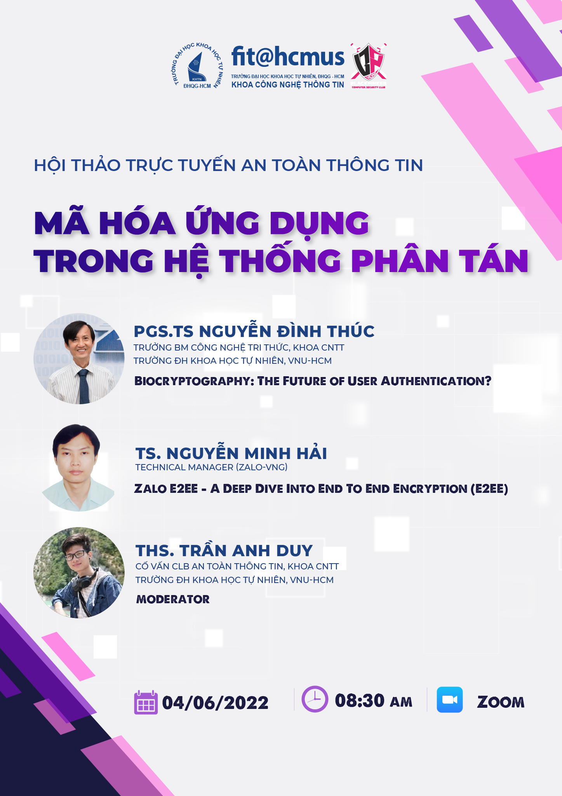

## 🔐 HỘI THẢO TRỰC TUYẾN "MÃ HÓA ỨNG DỤNG TRONG HỆ THỐNG PHÂN TÁN" 🔐

📌 Tham gia ngay: https://bit.ly/hcmus-securityday2022-dangky

### 🎉 Thông tin chi tiết 🎉

    ⏰ Thời gian: 8h30, ngày 04/06/2022

    🎫 Địa điểm: Trực tuyến (Zoom)
        (link đăng ký sẽ đóng khi đủ số lượng) 

### &#127775; Nội dung của buổi hội thảo &#127775;

    [Chủ đề 1] 𝗕𝗶𝗼𝗰𝗿𝘆𝗽𝘁𝗼𝗴𝗿𝗮𝗽𝗵𝘆: 𝗧𝗵𝗲 𝗙𝘂𝘁𝘂𝗿𝗲 𝗼𝗳 𝗨𝘀𝗲𝗿 𝗔𝘂𝘁𝗵𝗲𝗻𝘁𝗶𝗰𝗮𝘁𝗶𝗼𝗻?

       ✨ PGS.TS Nguyễn Đình Thúc - Trưởng BM Công nghệ Tri thức, Khoa CNTT, trường ĐH Khoa học Tự nhiên, VNU-HCM

    [Chủ đề 2] 𝐙𝐚𝐥𝐨 𝐄𝟐𝐄𝐄 - 𝐀 𝐃𝐞𝐞𝐩 𝐃𝐢𝐯𝐞 𝐈𝐧𝐭𝐨 𝐄𝐧𝐝 𝐓𝐨 𝐄𝐧𝐝 𝐄𝐧𝐜𝐫𝐲𝐩𝐭𝐢𝐨𝐧 (𝐄𝟐𝐄𝐄)

        ✨ TS. Nguyễn Minh Hải - Technical Manager (Zalo-VNG)

### Moderator

    ✨ THS. Trần Anh Duy - Cố vấn Câu lạc bộ ATTT, Khoa CNTT, trường ĐH Khoa học Tự nhiên, VNU-HCM